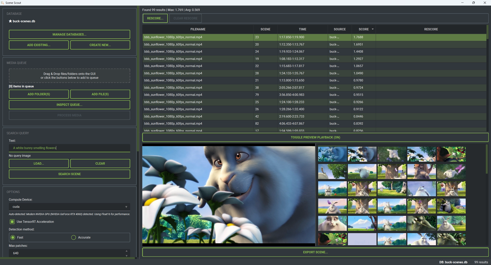
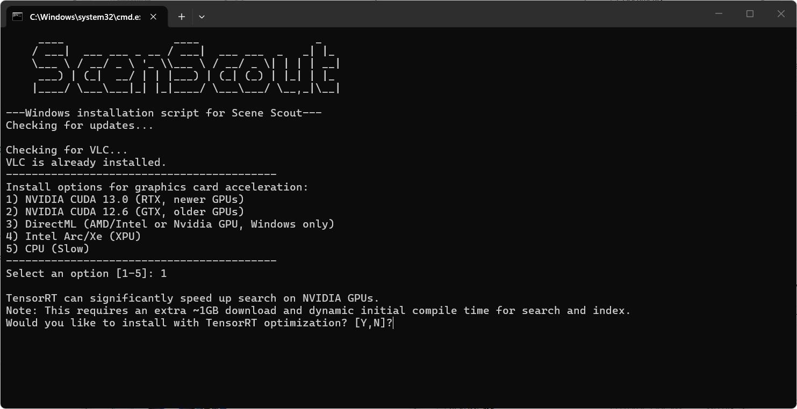
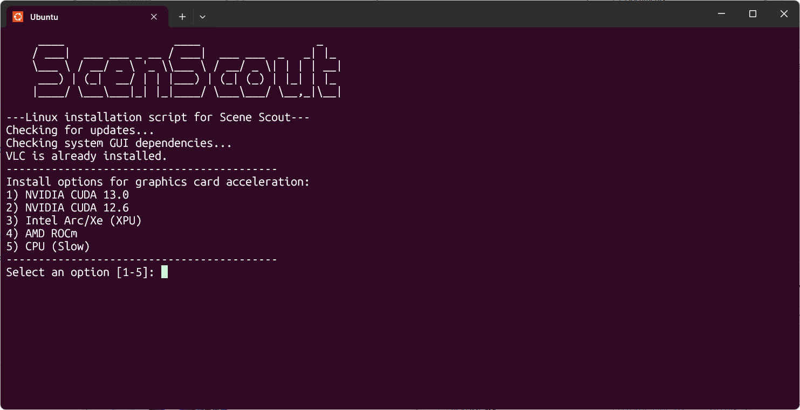
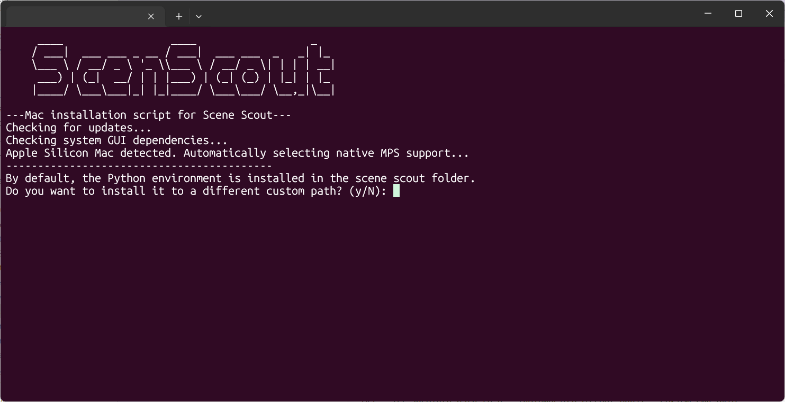
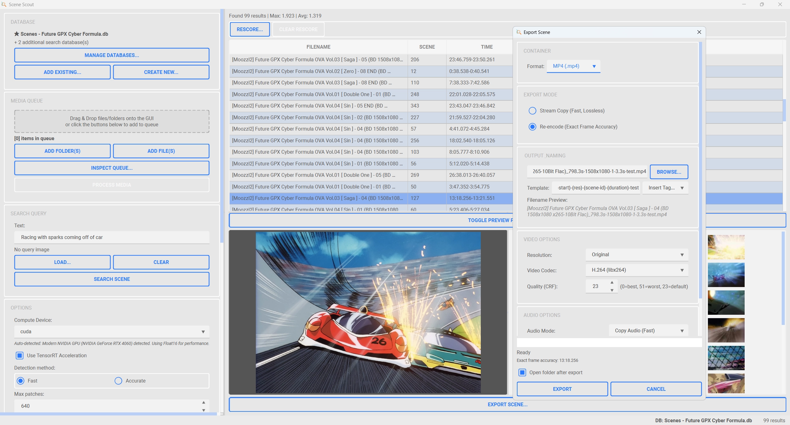
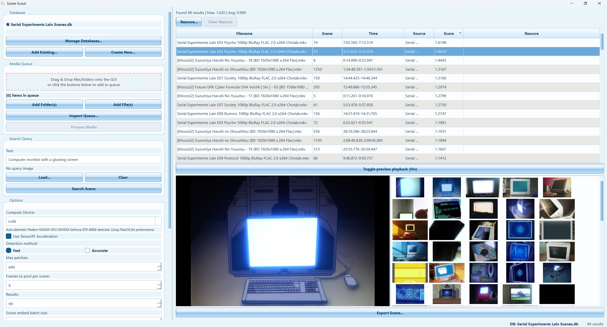
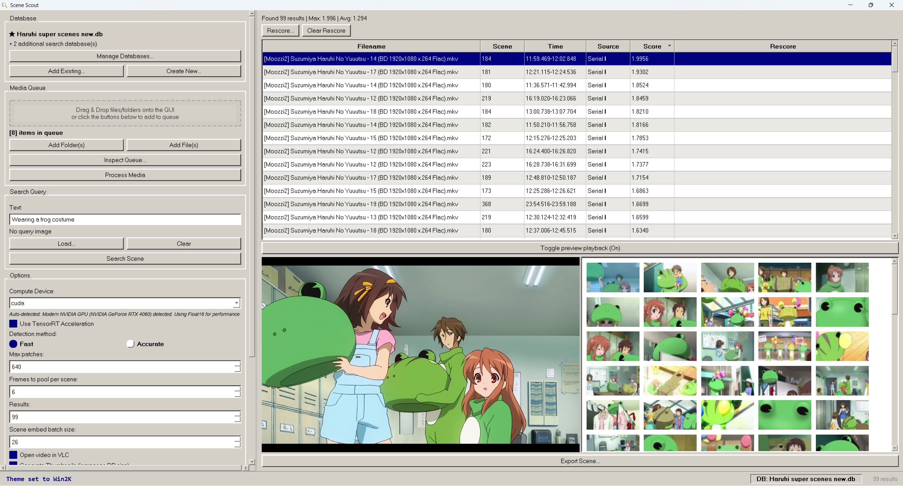
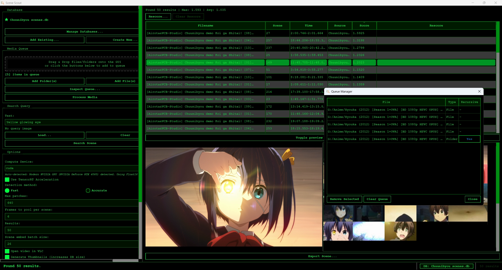
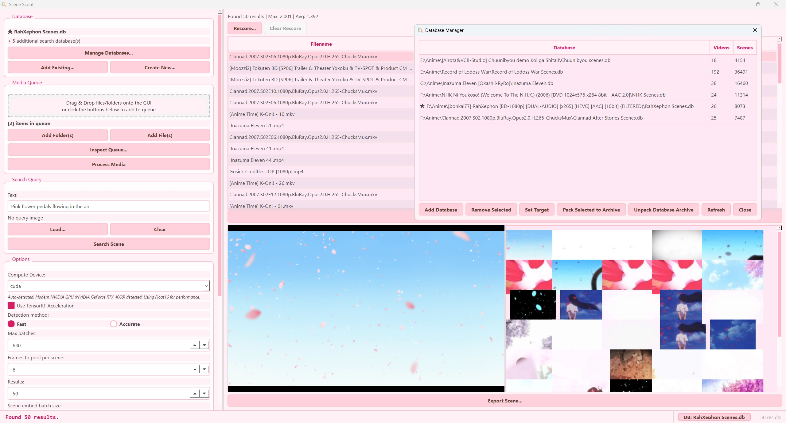

<br>
<br>
<p align="center">
  
</p>
<br>
<br>

<p align="center">
  <a href="https://github.com/Mark-Shun/scene-scout/releases/latest"></a>
  <a href="LICENSE"></a>
  <a href="https://github.com/Mark-Shun/scene-scout/stargazers"></a>
  <a href="https://github.com/Mark-Shun/scene-scout/releases"></a>
  <a href="https://mark-shun.github.io/scene-scout/"></a>
  <a href="https://ko-fi.com/sonicfreak1111">
    
  </a>
</p>

# Scene Scout - A scene search tool using keywords

This is the public repository of the tool.

A natural language scene search tool powered by [Google's SigLIP 2 model](https://huggingface.co/google/siglip2-so400m-patch16-naflex) with NaFlex architecture. Search through your local video collection using natural language queries or image similarity.


## Features
- **Multiplatform support**: Through the usage of seperate install scripts and UV, support for: Windows, Linux and Mac platforms.
- **Natural language search**: Find video scenes using text descriptions
- **Multi-Database Search**: Query multiple databases simultaneously with merged, deduplicated results and source database labels
- **Image-to-Scene search**: Search a scene using reference images
- **Video playback support**: Watch the scene play out in the GUI
- **Scene Export**: Export video scenes with customizable FFmpeg settings (Stream Copy/Re-encode), audio options, and progress tracking
- **Dual interface**: Available both as GUI and CLI
- **Standalone CLI**: Options for an interactive CLI interface with the possibility to retrieve JSON data of search results.
- **GPU acceleration**: Supports for various acceleration platforms (CPU (Apple SMP), CUDA, TensorRT, DML, Intel Arc/Xe, AMD ROCm)
- **Flexible patch sizes**: From 128 to 1024 patches for resolution control
- **SQLite database**: Efficient embedding storage with scene data and a small thumbnail in Blob storage format.
- **Media Queue System**: Index multiple files/folders at once with a persistent queue, drag-and-drop support, and per-item settings
- **Database Manager**: Popup interface to manage databases, set search targets, and view scene/video/image statistics
- **Interactive Shell**: REPL mode with command aliases, tab completion, persistent history, and built-in database management commands
- **Logging & Diagnostics**: Global logging with rotating file handler captures all crashes and stack traces to `scene_scout.log`, with configurable log levels
- **Database Archiving (`.scdb`)**: Pack databases into portable archives for sharing or backup, with automatic path recalibration on import

## Installation

### Setup

## *1: Get the latest release of Scene Scout:*

https://github.com/Mark-Shun/scene-scout/releases/latest

Or clone it on your computer:

```bash
git clone https://github.com/Mark-Shun/scene-scout
```

## *2: Use your OS install script:*
```bash
Windows run: windows-install.bat
```
```bash
Linux run: ./linux-install.sh
```
```bash
Mac run: ./mac-install.sh
```
During this step the install script will automatically install UV, Python, VLC, Pyside6 and all the required dependencies, depending on which options the user selected.

You will be prompted to choose between a **Standard Update** (fast, updates modified packages only) or a **Clean Install** (wipes and recreates the environment to fix corrupted dependencies).

Optionally, you can specify a **custom installation path** for the Python environment — useful if your primary drive has limited space and you want to store the environment files on a secondary drive.


### *2.5: Choose GPU or CPU option:*

During installation you can choose the appropriate option for your system. If you don't have a graphics card or your setup is not supported, then it's also possible to run the tool with the CPU. However general performance is way slower.

Choosing **NVIDIA CUDA 13.0** will additionally prompt about installing **TensorRT optimization** (~1GB extra) for significant compress/search speedups on RTX GPUs.

! Specifically for Apple Mac with M chips, there is MPS support.

<div style="display: flex; gap: 10px;">
  
  
  
</div>

## *3: Launch Scene Scout*
```bash
Windows run: windows-scene-scout.bat (or use the shortcut)
```
```bash
Linux run: linux-scene-scout.sh
```
```bash
Mac run: mac-scene-scout.command
```

## Usage

### GUI Mode

When launching the tool through run script file (or a python environment with appropriate packages)

It will automatically download the vision model and launch the graphical user interface.

The GUI provides:
- Database selection and management
- Media queue for indexing multiple files and folders
- Model configuration (patches, video settings)
- A video playback viewer to watch the scene
- Result visualization with similarity scores
- An export window to save selected scenes as video files



*Export video scene window*


<table align="center" width="100%">
  <tr>
    <td width="20%"></td>
    <td width="20%"></td>
    <td width="20%"></td>
        <td width="20%"></td>
  </tr>
</table>

*Example queries to search for scenes*

<summary><h4>GUI quick start guide</h4></summary>
  
> **Advice for a more convenient use**  
>  
> Model settings (number of patches, video frame parameters, and videos folder) only take effect **during the media processing phase**.  
>  
> Once files are indexed, the embeddings stored in the database remain fixed and will not change if you adjust the settings later.
>  
> So, for convenience, you can use the search tool without changing these parameters, and only tweak them when indexing new videos or re-indexing an existing collection.
>
> It is supported to drag and drop a database file, a folder and files in the GUI. It automatically adds them to the queue.

**First Time Setup (Creating a new database):**
 
1. Click **"Database->Create New..."** → Select where you want to create the database
2. *(Optional)* Click **"Manage Databases..."** to view statistics and configure multiple databases
3. Add files/folders to the queue using one of these methods:
   - **Drag & Drop**: Drop files or folders onto the queue area
   - **Add Folder(s)**: Browse and select directories to index recursively
   - **Add File(s)**: Browse and select individual media files
4. Click **"Inspect Queue..."** to review, remove items, toggle recursive scanning, or clean missing paths
5. Click **"Process Media"** to index all queued files (this may take time depending on dataset size and hardware)
6. Enter a search query in the "Text" field or click **"Load Query Image..."**
7. Click **"Search Scene"** to find matching scenes
8. *(Optional)* Search across multiple databases by adding more databases via "Manage Databases..."

**Exporting Scenes:**
- Right-click any video search result → **"Export Scene..."**
- Or click the **"Export Scene..."** button below the preview panel
- Choose between **Stream Copy** (fast, lossless) or **Re-encode** (exact frame accuracy)
- Customize video (codec, resolution, CRF) and audio (copy, disable, re-encode) options
- Progress bar shows real-time export status
- Some settings are saved between sessions via `scene_scout_config.json`, others are extracted from the source video.

**Searching an existing database:**

1. Click **"Database->Open Existing"** → Select your `.db` file
2. *(Optional)* Add more databases via **"Manage Databases..."** to search across multiple sources
3. Enter your search query (text, image, or both)
4. Click **"Search Scene"** to find matching scenes (results show source database)

**Adding New Files to Existing Database:**
1. Load your existing database
2. Add new files/folders to the queue (drag-drop, buttons, or inspect queue)
3. Click **"Process Media"** → only new/modified files will be processed

**Media Queue Features:**
- **Persistent queue**: Your queued items are saved with the database and persist between sessions
- **Drag & Drop**: Drop files, folders, or even `.db` files directly onto the GUI
- **Queue Manager**: Click "Inspect Queue..." to view all queued items, remove selected items, toggle recursive scanning, and clean up missing paths
- **Per-folder recursive toggle**: Control whether each folder scans subdirectories independently
- **Missing Path Detection**: Queue Manager shows `[MISSING]` tags for deleted paths with "Clean Missing" button

#### GUI Features
- **Visualized search results**: Get a list overview of the search results with the ability to watch the specific scene as a preview.
- **Search Source Column**: Results list displays which database each result originated from when searching multiple databases
- **Model Patches**: Higher values (512-1024) give better quality but are slower during indexing of images.
- **Video Settings**: Control how many frames are extracted and from where in the video
- **Threshold Slider**: Filter out low-similarity results (0.0 = show all, higher = more selective)
- **Cleanup Database**: Remove entries for deleted files to keep the database clean
- **Result Indicators**: `*` = excellent match (≥0.8), `-` = good match (≥0.6), `.` = lower match
- **Missing Path Detection**: Database Manager detects when video files are move or deleted, giving the user the ability to adjust (find) or remove these files.
- **Enhanced Update Popup**: Richly formatted GitHub release notes displayed in GUI popup when updates are available.
- **Automatic update**: If an update is available, the user can automatically download and install it through the terminal.


<summary><h3>CLI Mode</h3></summary>
It's also possible to interact with the tool through the terminal alone.
In this case you need a python environment with the appropriate packages.
(You can also activate the uv environment in .venv)

**Enter interactive mode**
```bash
Windows run: windows-scene-scout-cli.bat
```
```bash
Linux run: linux-scene-scout-cli.sh
```
```bash
Mac run: mac-scene-scout-cli.command
```

**Index a folder:**
```bash
python src/scenescout.py --index /path/to/images --db my_database.db
```

**Index multiple paths:**
```bash
python src/scenescout.py --index /path/to/videos --index /path/to/image_folder --index /path/to/single.mp4 --db my_database.db
```

**Search by text:**
```bash
python src/scenescout.py --search-text "sunset over mountains" --db my_database.db --top-k 20
```

**Search by image:**
```bash
python src/scenescout.py --search-image /path/to/query.jpg --db my_database.db
```

**Combined search (multimodal):**
```bash
python src/scenescout.py --search-text "red car" --search-image car.jpg --db my_database.db
```

#### CLI Options

- `--interactive` / `-i`: Enter interactive REPL mode
- `--json`: Output search results in JSON format
- `--include-thumbs`: Include base64 thumbnails in JSON output
- `--index PATH`: Path to folder or file to index (can be specified multiple times)
- `--search-text TEXT`: Text query (use `-` to read from stdin for piping)
- `--search-image PATH`: Image query path
- `--top-k N`: Number of results to return (default: 10)
- `--db PATH`: Database file path(s) - can specify multiple times for multi-database search (default: siglip2_embeddings.db)
- `--target-db PATH`: Target database for indexing operations when using multiple databases
- `--verify`: Check the target database for missing or moved video files
- `--relink ID PATH`: Update the file path of a database entry using its ID
- `--pack PATH`: Pack active databases into a `.scdb` portable archive
- `--unpack ARCHIVE DEST`: Unpack a `.scdb` archive to a destination folder (auto-adds databases to workspace)
- `--device {cuda,cpu,dml,xpu,mps}`: Force specific device
- `--max-patches N`: Max patches for model (default: 256)
- `--batch-size N`: Inference batch size (default: 16)
- `--accurate`: Use accurate scene detection instead of fast detection
- `--cleanup`: Remove orphaned embeddings
- `--silent`: Suppress all non-essential output including progress bars (ideal for automation)
- `--output FILE`: Write JSON output to file instead of stdout
- `--start MS`: Start time of the scene in milliseconds
- `--end MS`: End time of the scene in milliseconds

##### CLI Scene Export Options
- `--export-scene PATH`: Path of the video to export a scene from
- `--crf N`: Quality (0-51, lower=better, default: 23)
- `--video-codec {H.264 (libx264),H.265 (libx265),AV1 (libsvtav1),VP9 (libvpx-vp9),ProRes 422 (prores_ks)}`: Video codec for export
- `--audio-mode {copy,encode,disable}`: Audio mode for export
- `--audio-codec CODEC`: Audio codec for export (e.g. `AAC (aac)`, `MP3 (libmp3lame)`)
- `--audio-bitrate BITRATE`: Audio bitrate (e.g. `128k`, `192k`, `256k`, `320k`)
- `--resolution RES`: Output resolution (e.g. `1080p`, `720p`, `480p`, or `Custom 1920x1080`)

#### CLI Exit Codes
- `0`: Success
- `1`: Model error
- `2`: Database error
- `3`: Invalid input

#### Interactive Shell Commands
When in REPL mode (`--interactive`), use these commands:
- `s <query>`: Search scenes
- `i <paths>`: Index files/folders
- `cl`: Cleanup database
- `ls`: Show status
- `db ls`: List active databases
- `db add <path>`: Add a database
- `db rm <path>`: Remove a database
- `db target <path>`: Set target database for indexing
- `db clear`: Clear all databases
- `v`: Check the target database for missing or moved video files
- `rl <ID> <PATH>`: Update the file path of a database entry
- `p <output.scdb>` / `pack <output.scdb>`: Pack active databases into a `.scdb` portable archive (includes video files)
- `up <archive> <dest>` / `unpack <archive> <dest>`: Unpack a `.scdb` archive and auto-add databases to workspace
- `ex <indices> <output>`: Export scene(s) from last search results (e.g. `ex 1,2,5-8 ./exports/` for bulk)
- `rs <query>`: Rescore last search results with a new text query
- `update` / `u`: View full patch notes from latest release
- `vars`: List all editable shell variables
- `set <var> <value>`: Set a variable (with tab completion)
- `h` / `help`: Show help
- `q` / `exit`: Quit


## Video Support
The tool supports common video formats:
- MP4, AVI, MOV, MKV, FLV, WMV, WebM

Videos are indexed by extracting the timecodes of every (detected) scene.
Afterwards visual data for various frames of the scene is embedded into the database.


<summary><h2>Model configuration</h2></summary>

The tool uses Google's `siglip2-so400m-patch16-naflex` model with configurable patch counts:

- **128-256 patches**: Fast, good for general use
- **512 patches**: Balanced speed/quality
- **1024 patches**: Maximum quality for high-resolution images


<summary><h2>Database management</h2></summary>

Embeddings are stored in SQLite with automatic management:
- **Multi-database support**: Search across multiple databases simultaneously with merged, deduplicated results
- **Database Manager**: Popup interface showing database name, path, scene/video/image counts, and total statistics
- **Active databases**: Configure multiple active databases with a primary target for indexing operations
- **Queue persistence**: Index queue is stored per-database in SQLite and persists across sessions
- **Automatic migration**: Old `folder_path` and `db_path` config values are automatically migrated to the new queue and multi-database format
- **Portable archives (`.scdb`)**: Pack and unpack databases with their video files into a single archive for easy sharing, backup, or transferring between devices


<summary><h2>Performance tips</h2></summary>

- Start with 256 patches and increase if needed
- Use cleanup regularly to remove orphaned entries
- Index incrementally → only new/modified files are processed


<summary><h2>Technical details</h2></summary>

- **Model**: Google SigLIP 2 with NaFlex architecture
- **Embedding size**: 1152
- **Similarity metric**: Cosine similarity (dot product of normalized vectors)
- **Database**: SQLite with BLOB storage for embeddings and thumbnails
- **Database Schema**: Automatically migrate older database files to newer formats
- **Image processing**: PIL with decompression bomb protection disabled
- **Video processing**: For accurate detection, PySceneDetect is used to detect new scenes, for the fast detection method AV is utilised to quickly extract I-frames.
- **Video playback**: VLC is utilized for the video playback, when showing just the first frame AV is used.
- **Scene video export**: Utilising FFMPEG to export a chosen scene to a video.


## License

GPL v3 - See LICENSE file for details

## Acknowledgement
This project has been forked from [Gabrjiele's open source SigLip 2 NaFlex project](https://github.com/Gabrjiele/siglip2-naflex-search)
The focus on this fork has shifted from searching for videos/images in a user's collection to specifically searching for scenes through natural language queries. Further adjustments has been made both on the frontend and backend, due to this the two projects are no longer compatible.

- Google for the SigLIP 2 model
- Icon/logo made by Miwo

## Contributing

Check out [Contribution Guidelines](CONTRIBUTING.md)

## Author

Developed by Mark-Shun/Sonicfreak1111

Forked from project by Peris Gabriele