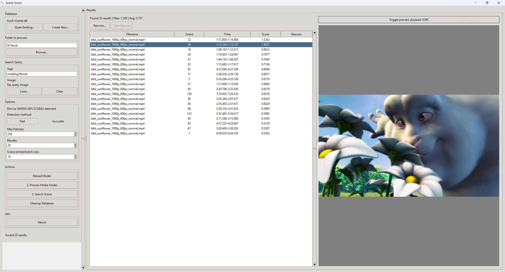
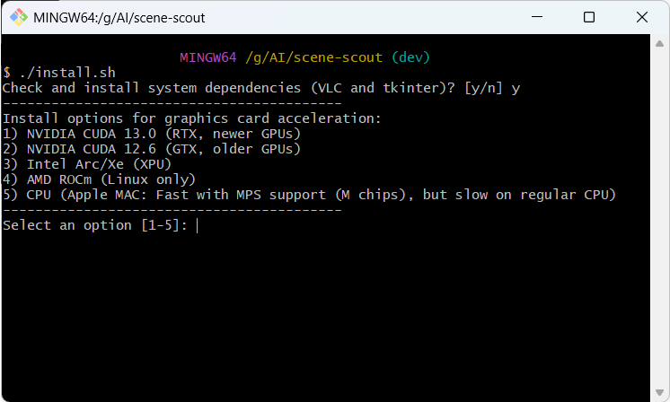
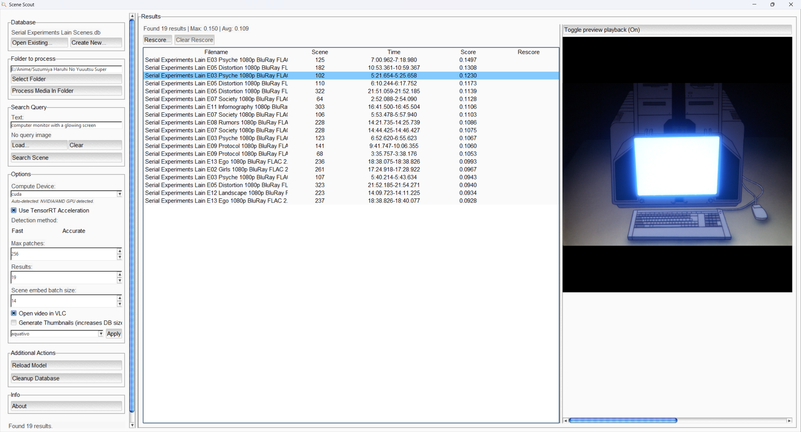
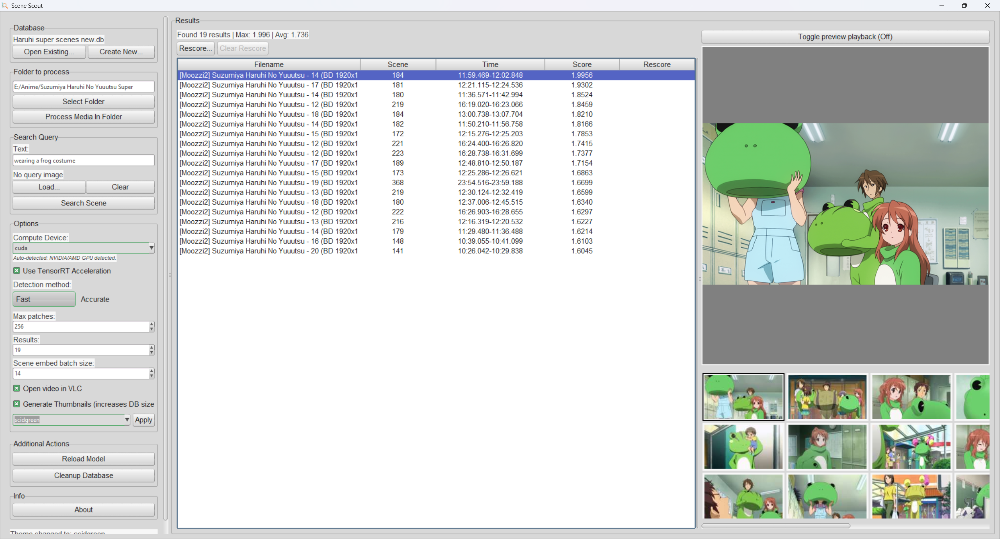
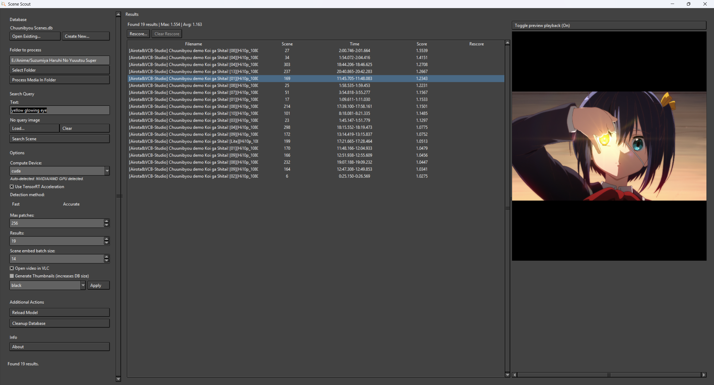

<br>
<br>
<p align="center">
  

</p>
<br>
<br>

<p align="center">
  <a href="https://github.com/Mark-Shun/scene-scout/releases/latest"></a>
  <a href="LICENSE"></a>
  <a href="https://github.com/Mark-Shun/scene-scout/stargazers"></a>
  <a href="https://github.com/Mark-Shun/scene-scout/releases"></a>
  <a href="https://mark-shun.github.io/scene-scout/"></a>
</p>

# Scene Scout - A scene search tool using keywords

A natural language scene search tool powered by [Google's SigLIP 2 model](https://huggingface.co/google/siglip2-so400m-patch16-naflex) with NaFlex architecture. Search through your local video collection using natural language queries or image similarity.


## Acknowledgement
This project has been forked from [Gabrjiele's open source SigLip 2 NaFlex project](https://github.com/Gabrjiele/siglip2-naflex-search)
The focus on this fork has shifted from searching for videos/images in a user's collection to specifically searching for scenes through natural language queries. Further adjustments has been made both on the frontend and backend where the two projects are no longer compatible.

## Features
- **Multiplatform support**: Through the usage of install scripts and UV, support for: Windows, Linux and Mac platforms.
- **Natural language search**: Find video scenes using text descriptions
- **Image-to-Scene search**: Search a scene using reference images
- **Video playback support**: Watch the scene play out in the GUI
- **Dual interface**: Available both as GUI and CLI
- **Standalone CLI**: Options for an interactive CLI interface with the possibility to retrieve JSON data of search results.
- **GPU acceleration**: Supports for various acceleration platforms (CPU (Apple SMP), CUDA, TensorRT, DML, Intel Arc/Xe, AMD ROCm)
- **Flexible patch sizes**: From 128 to 1024 patches for resolution control
- **SQLite database**: Efficient embedding storage with scene data and a small thumbnail in Blob storage format.

## Installation

### Setup

- 1: Get the latest release of Scene Scout: 

https://github.com/Mark-Shun/scene-scout/releases/latest

Or clone it on your computer:

```bash
git clone https://github.com/Mark-Shun/scene-scout
```

- 2: Install the environment and dependencies with the install script in your preffered terminal:
```
Windows run: install.bat
```
```
Mac/Linux run: install.sh
```
During this step the install script will automatically install UV, Python, VLC, tkinter and all the required dependencies, depending on which options the user selected.


- 2.5: Choose GPU or CPU option:

During installation you can choose the appropriate option for your system. If you don't have a graphics card or your setup is not supported, then it's also possible to run the tool with the CPU. However general performance is way slower.

! Specifically for Apple Mac with M chips, there is MPS support which is faster (choose the CPU option if that is the case).

<div style="display: flex; gap: 10px;">
  
  
</div>

- 3: Launch Scene Scout
```
Windows run: run_gui.bat
```
```
Mac/Linux run: run_gui.sh
```

## Usage

### GUI Mode

When launching the tool through run script file (or a python environment with appropriate packages)

It will automatically download the vision model and launch the graphical user interface.

The GUI provides:
- Database and folder selection
- Model configuration (patches, video settings)
- A video playback viewer to watch the scene
- Result visualization with similarity scores

Example queries:
<table align="center" width="100%">
  <tr>
    <td width="20%"></td>
    <td width="20%"></td>
    <td width="20%"></td>
  </tr>
</table>


<summary><h4>GUI quick start guide</h4></summary>
  
> **Advice for a more convenient use**  
>  
> Model settings (number of patches, video frame parameters, and videos folder) only take effect **during the indexing phase**.  
>  
> Once files are indexed, the embeddings stored in the database remain fixed and will not change if you adjust the settings later.  
>  
> So, for convenience, you can use the search tool without changing these parameters, and only tweak them when indexing new videos or re-indexing an existing collection.
>
> It is supported to drag and drop a database file and a folder in the GUI. It automatically resolves the paths.

**First Time Setup (Creating a new database):**

1. Click **"Database->Create New..."** → Select the folder where you want to create the database
2. Click **"Browse"** and select the directory with the files you want to index
3. Click **"Process Media folder"** to process all files in the selected folder (this may take several time depending on dataset size, files size, selected resolution and hardware)
4. Enter a search query in the "Text" field or click **"Load Query Image..."**
5. Click  **"Enter or the Search Scene button"** to find matching scenes

**Searching an existing database:**

1. Click **"Database->Open existing"** → Select your `.db` file
2. Enter your search query (text, image, or both)
3. Click  **"Enter or the Search Scene button"** to find matching scenes

**Adding New Scenes to Existing Database:**
1. Load your existing database
2. Browse to select the folder (can be the same or a different one)
4. Click **"Process Media folder"** → only new/modified files will be processed

#### GUI Features
- **Visualized search results**: Get a list overview of the search results with the ability to watch the specific scene as a preview.
- **Model Patches**: Higher values (512-1024) give better quality but are slower during indexing of images.
- **Video Settings**: Control how many frames are extracted and from where in the video
- **Threshold Slider**: Filter out low-similarity results (0.0 = show all, higher = more selective)
- **Cleanup Database**: Remove entries for deleted files to keep the database clean
- **Result Indicators**: `*` = excellent match (≥0.8), `-` = good match (≥0.6), `.` = lower match


<summary><h3>CLI Mode</h3></summary>
It's also possible to interact with the tool through the terminal alone.
In this case you need a python environment with the appropriate packages.
(You can also activate the uv environment in .venv)

Enter interactive mode
```
Windows run: run_cli.bat
```
```
Mac/Linux run: run_cli.sh
```

Index a folder:
```bash
python src/scenescout.py --index /path/to/images --db my_database.db
```

Search by text:
```bash
python src/scenescout.py --search-text "sunset over mountains" --db my_database.db --top-k 20
```

Search by image:
```bash
python src/scenescout.py --search-image /path/to/query.jpg --db my_database.db
```

Combined search (multimodal):
```bash
python src/scenescout.py --search-text "red car" --search-image car.jpg --db my_database.db
```

#### CLI Options

- `--interactive`: Enter interactive REPL mode
- `--json`: Output search results in JSON format
- `--include-thumbs`: Include base64 thumbnails in JSON output
- `--index PATH`: Folder to index
- `--search-text TEXT`: Text query (use `-` to read from stdin for piping)
- `--search-image PATH`: Image query path
- `--top-k N`: Number of results to return (default: 10)
- `--db PATH`: Database file path (default: siglip2_embeddings.db)
- `--device {cuda,cpu,dml,xpu,mps}`: Force specific device
- `--max-patches N`: Max patches for model (default: 256)
- `--batch-size N`: Inference batch size (default: 16)
- `--accurate`: Use accurate scene detection instead of fast detection
- `--cleanup`: Remove orphaned embeddings
- `--silent`: Suppress all non-essential output including progress bars (ideal for automation)
- `--output FILE`: Write JSON output to file instead of stdout


## Video Support
The tool supports common video formats:
- MP4, AVI, MOV, MKV, FLV, WMV, WebM

Videos are indexed by extracting the timecodes of every (detected) scene.
Afterwards visual data for the first frame of the scene is embedded into the database.


<summary><h2>Model configuration</h2></summary>

The tool uses Google's `siglip2-so400m-patch16-naflex` model with configurable patch counts:

- **128-256 patches**: Fast, good for general use
- **512 patches**: Balanced speed/quality
- **1024 patches**: Maximum quality for high-resolution images


<summary><h2>Database management</h2></summary>

Embeddings are stored in SQLite with automatic management:
- Only modified or new files are re-indexed
- Deleted files can be cleaned up with `--cleanup` flag
- Each entry stores filepath, timestamp, embedding, and file type


<summary><h2>Performance tips</h2></summary>

- Start with 256 patches and increase if needed
- Use cleanup regularly to remove orphaned entries
- Index incrementally → only new/modified files are processed


<summary><h2>Technical details</h2></summary>

- **Model**: Google SigLIP 2 with NaFlex architecture
- **Embedding size**: 1152
- **Similarity metric**: Cosine similarity (dot product of normalized vectors)
- **Database**: SQLite with BLOB storage for embeddings and thumbnails
- **Image processing**: PIL with decompression bomb protection disabled
- **Video processing**: For accurate detection, PySceneDetect is used to detect new scenes, for the fast detection method AV is utilised to quickly extract I-frames.
- **Video playback**: VLC is utilized for the video playback, when showing just the first frame AV is used.


## License

MIT License - See LICENSE file for details

## Acknowledgments

- Google for the SigLIP 2 model
- Icon/logo made by Miwo

## Contributing

This project follows the [all-contributors](https://github.com/all-contributors/all-contributors) specification. Contributions of any kind are welcome!

## Author

Created by Mark-Shun/Sonicfreak

Forked from project by Peris Gabriele